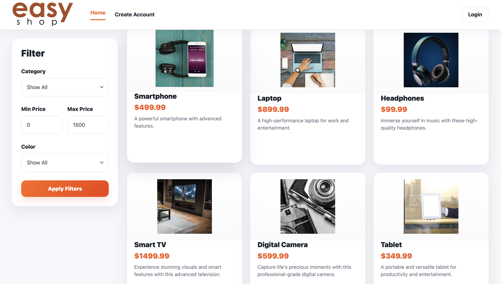
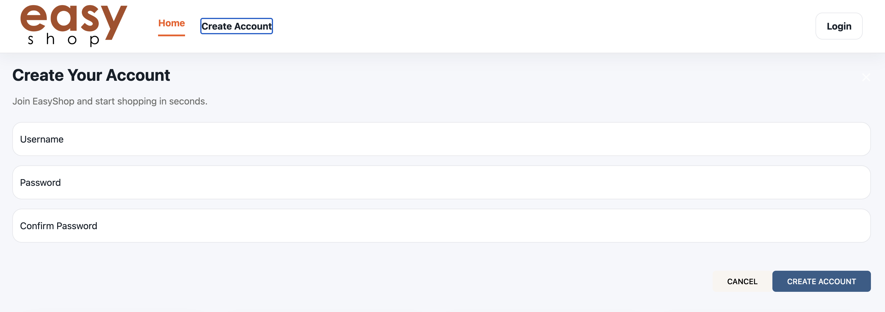
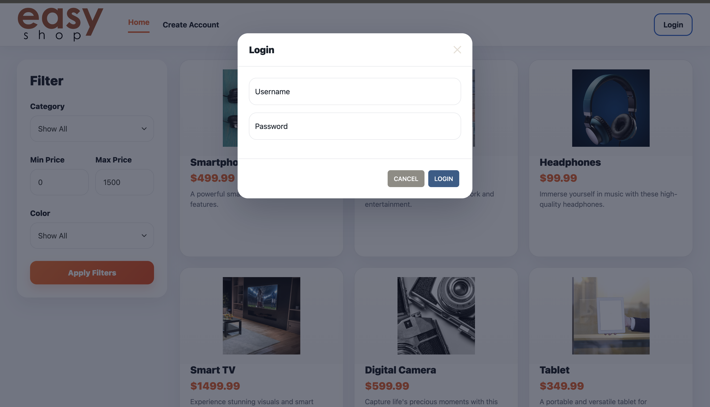
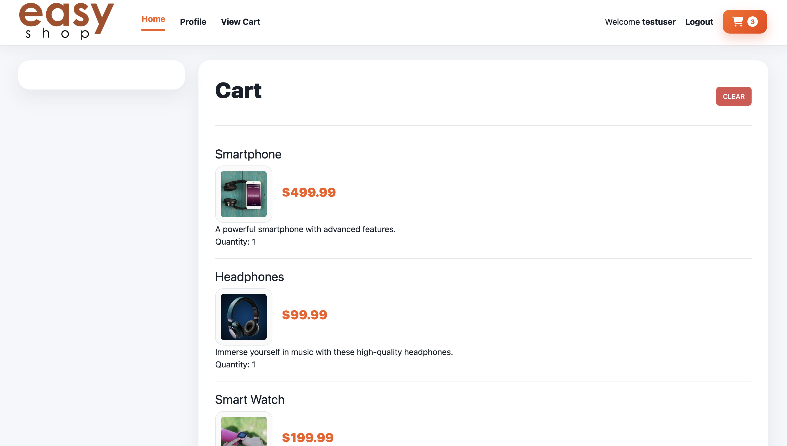
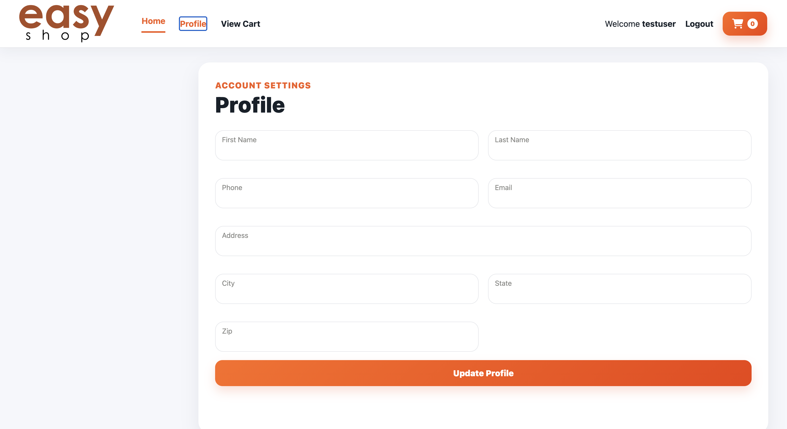

# 🛒 EasyShop

A full-stack e-commerce web application built with **Spring Boot**, **Spring Security**, **MySQL**, and a modern **HTML/CSS/JavaScript** frontend. EasyShop allows users to browse products, filter items by category and price, manage a shopping cart, create an account, authenticate securely using JWT tokens, and manage their personal profile.

This project was completed as a capstone to demonstrate full-stack application development, RESTful API design, secure authentication, database integration, and modern frontend development.

---

# 📑 Table of Contents

* Overview
* Features
* Screenshots
* Technologies Used
* Architecture
* Database Design
* REST API
* Security
* Project Structure
* Object-Oriented Programming Concepts
* Challenges
* Lessons Learned
* Future Improvements
* Installation
* Acknowledgements
* Author

---

# 📖 Overview

EasyShop simulates the core functionality of an online shopping platform. Users can register for an account, securely authenticate using JWT tokens, browse products, filter products by multiple criteria, manage their shopping cart, and maintain their account profile.

The project emphasizes clean architecture by separating responsibilities into controllers, services, repositories, models, mappers, and frontend components.

---

# ✨ Features

## 👤 User Accounts

* User Registration
* Secure Login
* JWT Authentication
* Logout
* Profile Management

---

## 🛍 Product Catalog

* Browse all products
* Product image gallery
* Product descriptions
* Product pricing
* Responsive product cards

---

## 🔍 Product Filtering

Users can filter products by:

* Category
* Color
* Minimum Price
* Maximum Price

Filtering updates products without requiring a page refresh.

---

## 🛒 Shopping Cart

* Add products to cart
* View cart contents
* Display quantities
* Display product images
* Clear cart

---

## 🎨 Modern UI

The frontend was redesigned to provide a cleaner and more modern shopping experience featuring:

* Responsive layout
* Product cards
* Sticky filter panel
* Modern navigation bar
* Improved typography
* Consistent color palette
* Hover animations
* Rounded cards
* Improved spacing

---

# 📸 Screenshots

## Home Page


## Registration


## Login


## Shopping Cart


## Profile Page



---

# 🛠 Technologies Used

## Backend

* Java 21
* Spring Boot
* Spring Security
* Spring Data JPA
* Hibernate
* JWT Authentication
* Maven

---

## Frontend

* HTML5
* CSS3
* JavaScript
* Axios
* Bootstrap
* Mustache.js
* Font Awesome

---

## Database

* MySQL

---

## Development Tools

* IntelliJ IDEA
* Insomnia
* Git
* GitHub

---

# 🏗 Architecture

The project follows a layered architecture.

```
Client
      │
      ▼
Controllers
      │
      ▼
Services
      │
      ▼
Repositories
      │
      ▼
MySQL Database
```

Each layer has a single responsibility, making the project easier to maintain and extend.

---

# 🗄 Database Design

The application stores information for:

* Users
* User Profiles
* Products
* Categories
* Shopping Cart
* Shopping Cart Items

Relationships are managed using JPA and Hibernate entity mappings.

---

# 🌐 REST API

The backend exposes RESTful endpoints for:

### Authentication

```
POST /login

POST /register
```

### Products

```
GET /products

GET /products/{id}
```

### Categories

```
GET /categories
```

### Shopping Cart

```
GET /cart

POST /cart/products/{id}

DELETE /cart
```

### Profile

```
GET /profile

PUT /profile
```

---

# 🔐 Security

Security is implemented using Spring Security and JWT authentication.

Features include:

* BCrypt password hashing
* Stateless authentication
* JWT Bearer Tokens
* Protected API endpoints
* Role-based authorization
* Authentication filters

---

# 📂 Project Structure

```
src
│
├── controllers
├── services
├── repositories
├── models
├── dto
├── mapper
├── configuration
├── security
│
resources
│
├── templates
├── static
│
└── application.yml
```

---

# 💡 Object-Oriented Programming Concepts

This project demonstrates several core OOP principles.

### Encapsulation

Business logic is contained within service classes while entities expose only the data necessary for the application.

### Inheritance

Spring Security components and framework abstractions are extended where appropriate.

### Polymorphism

Interfaces such as repositories and service abstractions allow different implementations while maintaining a consistent API.

### Abstraction

Controllers communicate with DTOs and services rather than directly interacting with the database layer.

---

# 🚧 Challenges

Some of the biggest challenges encountered during development included:

* Configuring JWT authentication
* Spring Security authorization
* Managing user roles
* Mapping DTOs with MapStruct
* Fixing image path issues
* Designing a responsive frontend
* Connecting the frontend to secured REST endpoints
* Debugging API responses
* Managing shopping cart state

Working through these issues provided valuable experience debugging both frontend and backend applications.

---

# 📚 Lessons Learned

This project strengthened my understanding of:

* REST API development
* Spring Boot architecture
* Spring Security
* JWT authentication
* JPA/Hibernate relationships
* Database design
* Frontend development
* Asynchronous JavaScript using Axios
* MVC architecture
* Client/server communication
* Debugging full-stack applications

---

# 🚀 Future Improvements

Future enhancements could include:

* Product search
* Product reviews and ratings
* Wishlist functionality
* Checkout process
* Order history
* Inventory management
* Admin dashboard
* Product recommendations
* Quantity controls within the shopping cart
* Responsive mobile navigation
* Dark mode
* Payment gateway integration (Stripe/PayPal)

---

# ⚙ Installation

Clone the repository

```bash
git clone https://github.com/yourusername/easyshop.git
```

Navigate into the project

```bash
cd easyshop
```

Configure the MySQL database inside

```
application.yml
```

Run the Spring Boot application

```
mvn spring-boot:run
```

Launch the frontend and begin shopping.

---

# 🙏 Acknowledgements

UI design improvements, frontend styling refinements, debugging assistance, and technical guidance were completed with the assistance of **OpenAI's ChatGPT (GPT-5.5)**.

---

# 👤 Author

Created by **Nathan Wondim**

---

# 📄 License

This project is licensed under the MIT License – see the **LICENSE.md** file for details.

---

### Year Up United Software Development Student

EasyShop was created as a full-stack e-commerce capstone project to demonstrate modern software engineering practices using Java, Spring Boot, Spring Security, REST APIs, JWT authentication, MySQL, and responsive frontend development.

Special thanks to **OpenAI's ChatGPT (GPT-5.5)** for providing guidance with frontend UI design, debugging, and technical explanations throughout the development process.